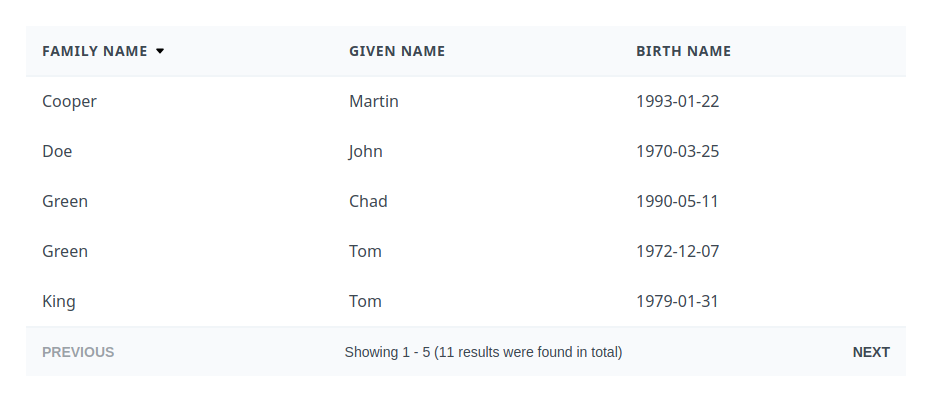

![Built With Stencil](https://img.shields.io/badge/-Built%20With%20Stencil-16161d.svg?logo=data%3Aimage%2Fsvg%2Bxml%3Bbase64%2CPD94bWwgdmVyc2lvbj0iMS4wIiBlbmNvZGluZz0idXRmLTgiPz4KPCEtLSBHZW5lcmF0b3I6IEFkb2JlIElsbHVzdHJhdG9yIDE5LjIuMSwgU1ZHIEV4cG9ydCBQbHVnLUluIC4gU1ZHIFZlcnNpb246IDYuMDAgQnVpbGQgMCkgIC0tPgo8c3ZnIHZlcnNpb249IjEuMSIgaWQ9IkxheWVyXzEiIHhtbG5zPSJodHRwOi8vd3d3LnczLm9yZy8yMDAwL3N2ZyIgeG1sbnM6eGxpbms9Imh0dHA6Ly93d3cudzMub3JnLzE5OTkveGxpbmsiIHg9IjBweCIgeT0iMHB4IgoJIHZpZXdCb3g9IjAgMCA1MTIgNTEyIiBzdHlsZT0iZW5hYmxlLWJhY2tncm91bmQ6bmV3IDAgMCA1MTIgNTEyOyIgeG1sOnNwYWNlPSJwcmVzZXJ2ZSI%2BCjxzdHlsZSB0eXBlPSJ0ZXh0L2NzcyI%2BCgkuc3Qwe2ZpbGw6I0ZGRkZGRjt9Cjwvc3R5bGU%2BCjxwYXRoIGNsYXNzPSJzdDAiIGQ9Ik00MjQuNywzNzMuOWMwLDM3LjYtNTUuMSw2OC42LTkyLjcsNjguNkgxODAuNGMtMzcuOSwwLTkyLjctMzAuNy05Mi43LTY4LjZ2LTMuNmgzMzYuOVYzNzMuOXoiLz4KPHBhdGggY2xhc3M9InN0MCIgZD0iTTQyNC43LDI5Mi4xSDE4MC40Yy0zNy42LDAtOTIuNy0zMS05Mi43LTY4LjZ2LTMuNkgzMzJjMzcuNiwwLDkyLjcsMzEsOTIuNyw2OC42VjI5Mi4xeiIvPgo8cGF0aCBjbGFzcz0ic3QwIiBkPSJNNDI0LjcsMTQxLjdIODcuN3YtMy42YzAtMzcuNiw1NC44LTY4LjYsOTIuNy02OC42SDMzMmMzNy45LDAsOTIuNywzMC43LDkyLjcsNjguNlYxNDEuN3oiLz4KPC9zdmc%2BCg%3D%3D&colorA=16161d&style=flat-square)

# Simbuka Table

Basic components to easily build good looking front-end table.



#### Features

-   Loader
-   Overlay
-   Pagination
-   Sorting for `th` (just icons and events)

#### Events

-   [`onSortChange`](src/components/th)
-   [`onPageChange`](src/components/table-pagination)

# Installation

```
npm install --save @simbuka/table
```

#### IMPORTANT: this library uses CSS library [`Tailwind CSS`](https://tailwindcss.com/docs/installation). You must install it manually.

# Components

-   [`smb-table`](src/components/table) (instead of `<table>`)
-   [`smb-thead`](src/components/thead) (instead of `<thead>`)
-   [`smb-tbody`](src/components/tbody) (instead of `<tbody>`)
-   [`smb-th`](src/components/th) (instead of `<th>`)
-   [`smb-td`](src/components/td) (instead of `<td>`)
-   [`smb-pagination`](src/components/table-pagination)

# Usage

You can find more examples at [`src/index.html`](src/index.html)

```html
<!-- Simple table with pagination -->
<smb-table>
	<smb-thead>
		<smb-tr>
			<smb-th>
				Family name
			</smb-th>
			<smb-th>
				Given name
			</smb-th>
			<smb-th>
				Birth name
			</smb-th>
		</smb-tr>
	</smb-thead>

	<smb-tbody>
		<smb-tr>
			<smb-td>
				Green
			</smb-td>
			<smb-td>
				Tom
			</smb-td>
			<smb-td>
				1972-12-07
			</smb-td>
		</smb-tr>
		<smb-tr>
			<smb-td>
				Cooper
			</smb-td>
			<smb-td>
				Martin
			</smb-td>
			<smb-td>
				1993-01-22
			</smb-td>
		</smb-tr>
	</smb-tbody>

	<smb-pagination
		slot="pagination"
		found-text="Showing 2 - 11 (11 results were found in total)"
	></smb-pagination>
</smb-table>
```
